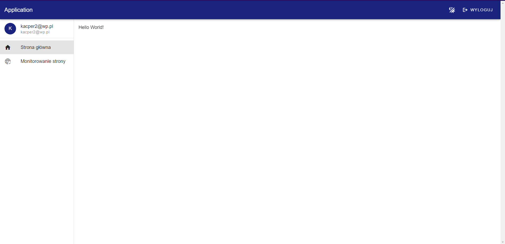
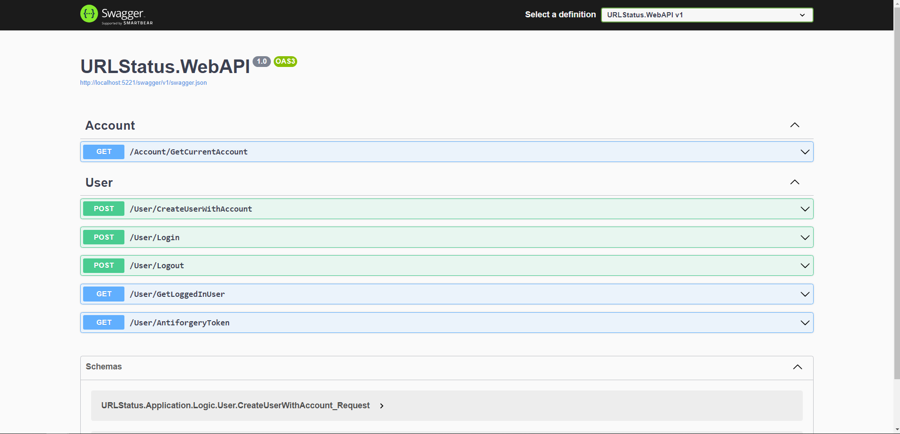

# URLStatus IN PROGRESS

This repository contains a .NET WebAPI project built using Clean Architecture principles in ASP.NET. The project structure includes separate layers for Domain, Application, Infrastructure, and WebAPI.

## 📺 YouTube Video Demo
[Watch the demo on YouTube](https://www.youtube.com/watch?v=p1Rij1dHZ44)

## 📸 Photos

## 🏗️ Project Structure
- **🗂️ Domain:** Core domain logic and business rules.
- **📦 Application:** Application logic and interactions between different layers.
- **🛠️ Infrastructure:** Data access, external services integration, etc.
- **🌐 WebAPI 8.0:** Startup project for the API.

## 📦 Current NuGet Packages
- **📊 SeriLog**
- **✅ FluentValidation**
- **🔄 MediatR**
- **🗄️ EntityFramework**
- **📄 SwashBuckle (Swagger)**

## 🚀 Current Features
- **Account Management:**
  - ➕ Create an account
  - ❌ Delete an account
  - ✔️ Verify user and account
  - 🔍 Create account validators (ensuring proper email and password formats)
- **Authentication:**
  - 🔑 Login and Logout
  - 🍪 Implement Cookies
  - 🔐 JWT Token authentication
- **Security:**
  - 🌍 Cross-Origin Resource Sharing (CORS) for enhanced project security
  - 🛡️ AntiForgeryToken implementation
  - 🛠️ Numerous validators ensuring security and correctness
- **Performance:**
  - 💾 Database caching

## 🗃️ Database Structure
- **Tables:**
  - 📂 Accounts
  - 📂 AccountUsers
  - 📂 Users
- **Relationships:**
  - An account can have multiple users with different permissions.
  - A user can belong to multiple accounts.

## 💻 Frontend
An easy-to-use website to test the backend and database abilities.

### 🛠️ Tech Stack
- **💻 JavaScript**
- **🖼️ Vue.js and Vuetify**
- **🌐 Nuxt.js**
- **🟢 Node.js**

---

